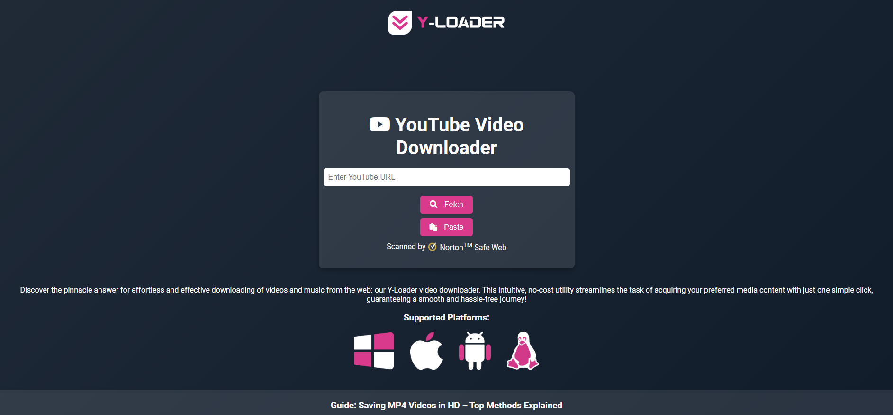



# YouTube Video Downloader

Welcome to the YouTube Video Downloader! This intuitive and free tool allows you to effortlessly download your favorite YouTube videos and music with just one click. Designed for a smooth and hassle-free experience, this downloader supports multiple formats and resolutions to meet your needs.

## Features

- **Download Videos in MP4 Format**: Supports H.264 encoding to ensure compatibility with most devices.
- **Download Audio in MP3 Format**: Available in 320kbps and 128kbps.
- **High-Quality Downloads**: Choose from various video resolutions and audio quality options.
- **Easy to Use**: A user-friendly interface that makes downloading simple and quick.
- **Secure**: Scanned by Norton Safe Web for your peace of mind.

## Installation

### Prerequisites

- **Node.js**: Ensure you have Node.js installed on your machine. You can download it from [nodejs.org](https://nodejs.org/).
- **FFmpeg**: This tool requires FFmpeg for video and audio processing. Install it from [ffmpeg.org](https://ffmpeg.org/download.html).

### Steps

1. **Clone the Repository**

   ```bash
   git clone https://github.com/visiontek-official/Y-Loader.git
   cd youtube-video-downloader

2. **Install Dependencies**

   ```bash
   npm install

3. **Configure SSL Certificates**
If you are using HTTPS, place your SSL certificates in the appropriate location and update the paths in server.js:

   ```bash
   const sslOptions = {
   key: fs.readFileSync('path/to/privkey.pem'),
   cert: fs.readFileSync('path/to/fullchain.pem')
   };

4. **Run the Server**

   ```bash
   node server.js

### 🛠️ Usage

1.	Open Your Browser: Navigate to http://localhost:3000 or https://localhost if using HTTPS.
2.	Enter YouTube URL: Paste the YouTube video URL into the input field.
3.	Fetch Video Info: Click the Fetch button to retrieve video details.
4.	Select Format: Choose the desired format and quality from the dropdown menu.
5.	Download: Click the Download button to start the download process. The file will be saved to your device automatically.

### 🤝 Contributing

We welcome contributions! Please fork the repository and create a pull request with your improvements.

### 📜 License

This project is licensed under the MIT License. See the [LICENSE](https://chatgpt.com/c/LICENSE)file for more details.

### 🛠️ Support

If you encounter any issues or have questions, please open an issue on GitHub.